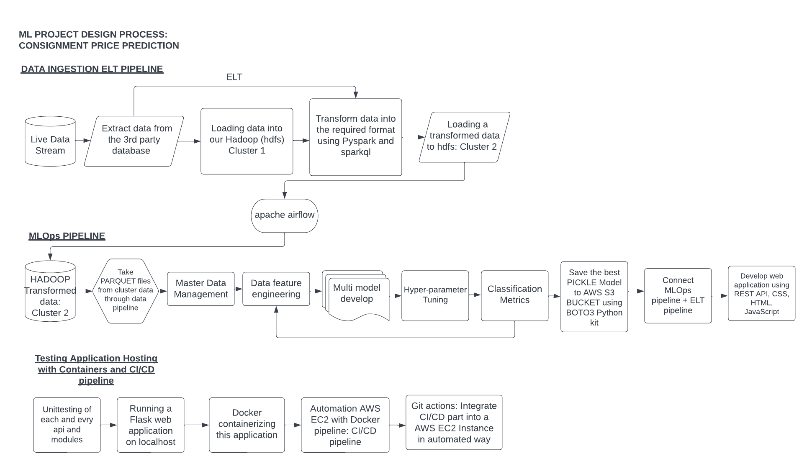

# Consignment-Product-Prediction
 

This project is going to focus on Consignment Product Prediction using the Machine Learning Algorithms, MLOps, CI/CD Pipeline, ETL Pipeline, Docker, DVC Pipeline, Apache Airflow, AWS S3 bucket, EC2 instance, Hadoop, HTML, CSS

• This repository consists of files required to deploy a ___Machine Learning Web App___ created with ___Flask___ on ___Heroku___ platform.

#Dataset Link: https://www.consumerfinance.gov/data-research/consumer-complaints/

 # Workflow Chart:

